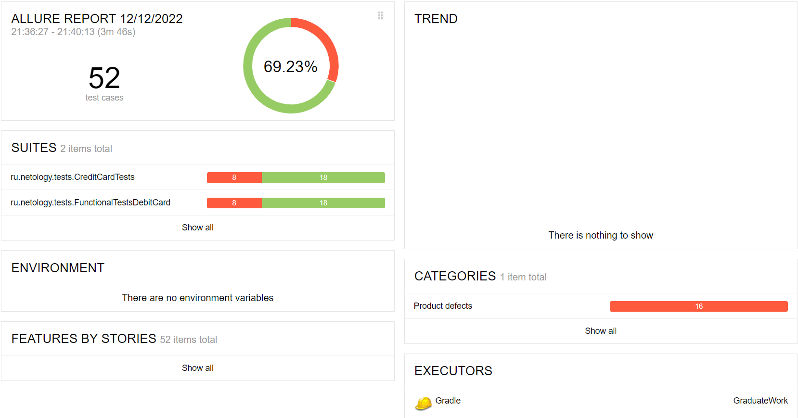
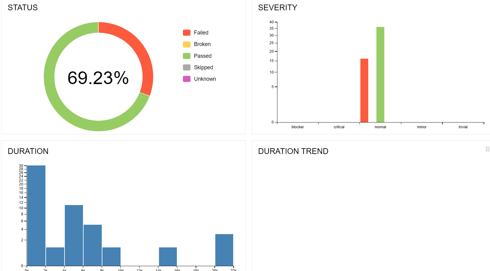
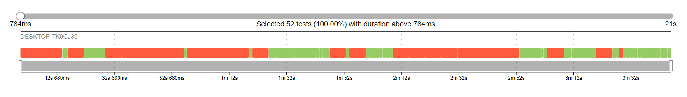
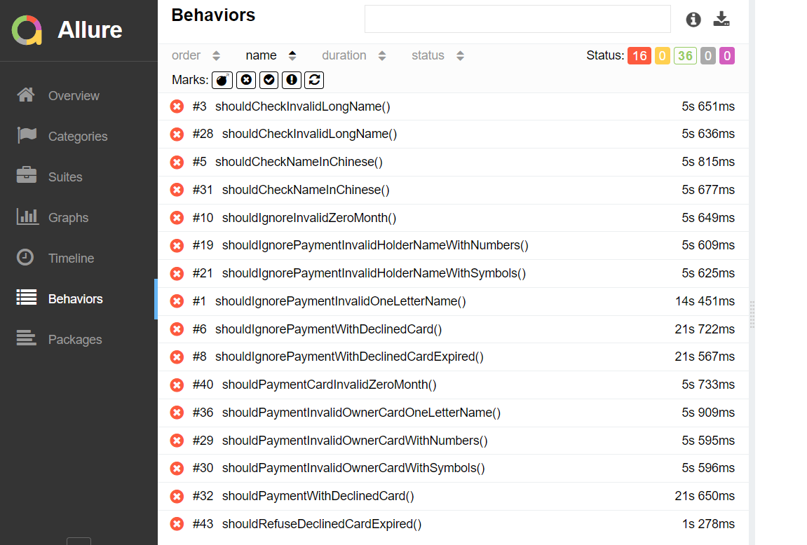

### Reporting

## Описание
- В рамках работы было проведено исследовательское тестирование, которому предшествовало развертывание БД MySQL и Postgres, Node.js, а также запуск SUT локально.
- На следующем этапе были зафиксированы и описаны тестовые случаи с использованием техник тест-дизайна
- По завершении последнего этапа был сформирован отчет Allure о тестировании и оформлены баг репорты.

## Результаты прогона тестов
- Всего тестовых кейсов описано 52
- успешных тестовых кейсов 36
- тесты завершились с ошибками 16
- 69% тестов завершилось успешно

## Рекомендации 

- Основной документ для оценки поведения системы - спецификация. Необходимо создать ее.
- Для тестирования API лучшей практикой будет написание Swagger
- Для улучшения тестопригодности следует написать уникальные селекторы

### Отчетность Allure

